<p align="center">
  <picture>
    <source media="(prefers-color-scheme: dark)" srcset="docs/brand/logo-wordmark-reversed.svg">
    
  </picture>
</p>

<p align="center">
  <b>A selective scan should open the files that can match — and nothing else.</b>
</p>

<p align="center">
  
  
  <a href="#measured"></a>
</p>

**kahshe** (*KAW-shee*, after Kahshe Lake) sits in front of your Apache Iceberg REST catalog and makes selective
queries open fewer files. No new table format, no migration, no engine change.

<table align="center"><tr>
<td width="50%"></td>
<td width="50%"></td>
</tr><tr>
<td align="center"><em>stock — 991 files, 6.6–11.5 s</em></td>
<td align="center"><em>through kahshe — 2 files, 0.34–0.44 s</em></td>
</tr></table>

<p align="center"><em>The same query, the same Spark, the same 247M rows. Only the catalog URI changed.</em></p>

## What it does

### Proxy

Point your engines at kahshe instead of the catalog. It forwards everything unchanged, except
scan planning: for that it returns only the data files that can match the query. Spark, Flink and
PyIceberg switch over with no configuration.

### Index

A term dictionary and n-gram blooms over the columns you name, stored as Parquet beside your data
and kept current in the background. They prune what min/max statistics never can — `LIKE '%needle%'`,
a regexp, a value every file's range spans. A file is skipped only when it certainly cannot match;
on any doubt it is kept. Delete the index and every query returns the same rows, slower.

### Watch

Detection rules — Sigma included — evaluated against each new data file as it lands, where the
data already is. No ingest pipeline. Every alert carries the SQL to see the rows.

## Quickstart

```bash
git clone https://github.com/Kahshe-io/kahshe.git && cd kahshe
docker compose up -d --build      # Polaris + kahshe; no published image yet, so 5–10 min the first time
docker compose run --rm seed      # creates logs.events with 'kahshe.index' = 'msg', four files
```

```
verified plan results (files returned out of 4):
  no filter                              -> 4
  id >= 3000 (min/max stats)             -> 1
  contains 'timeout' (3-gram bloom)      -> 1
  contains 'zzz-absent' (3-gram bloom)   -> 0
```

Ports 8282 and 8283 must be free — a local `bin/kahshe` holds both. `docker compose down -v` resets.

## Works with

| | you do | you get |
|---|---|---|
| **Polaris, Nessie, Lakekeeper, Unity, any REST catalog** | point engines at kahshe | passthrough plus pruned planning |
| **Spark 3.4–4.1, Flink batch** | nothing | pruned planning |
| **PyIceberg 0.12, Daft** | one catalog property: `scan-planning-mode: server` | pruning on `=`, `IN`, prefix, ranges |
| **Trino 483** | two overlaid classes — [`dev/trino-patch/`](dev/trino-patch/README.md) | pruned planning, until [trino#30891](https://github.com/trinodb/trino/pull/30891) lands |
| **Merge-on-read tables** | `KAHSHE_SERVE_DELETE_BEARING=true` | pruned planning for Spark and Flink; leave off if Trino reads through the proxy |
| **AWS Glue, S3 Tables** | — | not yet: SigV4 |

Every other engine passes through unchanged; the full matrix is in [docs/COMPATIBILITY.md](docs/COMPATIBILITY.md).

## Configuring the index

Table properties, nothing else — no DDL, no index service. kahshe sees them on `loadTable` and
builds in the background:

```sql
ALTER TABLE logs.events SET PROPERTIES (
  'kahshe.index'                  = 'msg,clientip',   -- the columns; this line alone is enough
  'kahshe.index.clientip.analyzer' = 'value',         -- whole values, not tokens: IPs, ids, UUIDs
  'kahshe.index.msg.ngram'         = '4'              -- gram size, when 3 saturates on dense text
)
```

Strings, integers, decimals, UUIDs, binary, lists and maps index. Every knob resolves per column,
then per table, then from the deployment default, and all are cost dials with no correctness
cliff: [docs/CONFIGURATION.md](docs/CONFIGURATION.md#1-table-properties).

<a id="measured"></a>
## Measured

| corpus · engine | query | stock | kahshe | index size |
|---|---|---|---|---|
| **httplogs** 247M rows · Spark 3.5.3 | `clientip = '71.162.18.0'` (2 rows) | 991 files, 6.6–11.5 s | **2 files, 0.34–0.44 s** | 0.9% of data |
| **ClickBench** 100M rows · Trino 483 + overlay | `regexp_like(URL, …)` (6 rows) | 1,000 files, 8,180 ms | **4 files, 3,000 ms** | 1.2% |

A Parquet native bloom on the same httplogs column still opened all 991 files: it prunes inside a
file, after the file is open. Low-n lab runs; every caveat and record: [benchmark/](benchmark/BENCHMARK.md).

## Deploying

```bash
KAHSHE_BACKEND=http://your-catalog:8181/api/catalog KAHSHE_CREDENTIAL=client:secret app/build/install/kahshe/bin/kahshe
helm install kahshe ./helm/kahshe --set backend.url=http://nessie:19120/iceberg
```

| decide this | why |
|---|---|
| `KAHSHE_TLS_CERT` / `KAHSHE_TLS_KEY` | kahshe serves TLS itself; unset, 8282 is plaintext with bearer tokens |
| `KAHSHE_TABLE_CACHE_TTL_MS=0` | required above one replica |
| `KAHSHE_INDEX_ROOT` | outside the table if maintenance runs `remove_orphan_files` |
| `KAHSHE_SERVE_DELETE_BEARING` | `false` while Trino reads through the proxy |

Alert on `kahshe_index_max_behind_seconds`. Authorization stays with your catalog: served endpoints
check the caller's own token can load the table. Everything else: [docs/OPERATIONS.md](docs/OPERATIONS.md).

## Read next

[Architecture](docs/ARCHITECTURE.md) · [Format](docs/FORMAT.md) · [Configuration](docs/CONFIGURATION.md) · [Endpoints](docs/ENDPOINTS.md) · [Operations](docs/OPERATIONS.md) · [Watch](docs/WATCH.md) · [Helm](helm/kahshe/README.md) · [Sigma](sigma/README.md) · [Benchmark](benchmark/BENCHMARK.md) · [Contributing](CONTRIBUTING.md)

Pre-release: 527 tests; not yet suitable for production traffic, and not running in production anywhere. Apache-2.0 — [LICENSE](LICENSE), [NOTICE](NOTICE).
Apache, Apache Iceberg and Iceberg are trademarks of the Apache Software Foundation.
